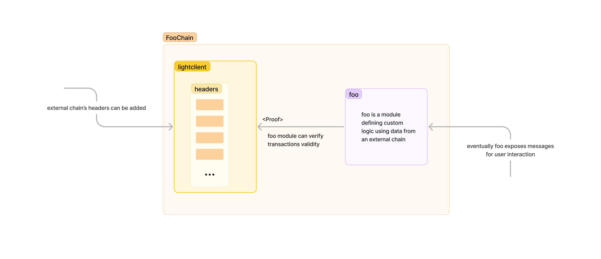

# Prototype of a Light Client for a Blockchain

## Prerequisites
Before diving into the task, we recommend familiarizing yourself with the basics of the Cosmos SDK. An understanding 
of its key concepts and architecture will greatly aid in the successful completion of this assignment.

If you're new to the Cosmos SDK, you might find the following resources helpful:

- [Cosmos SDK Documentation](https://docs.cosmos.network/v0.47/learn/intro/overview)
- [Cosmos SDK Tutorial](https://tutorials.cosmos.network/academy/0-welcome/)

We understand that getting started with Cosmos SDK can be complex within a limited timeframe but the task doesn't require to understand all the concepts. Our suggestion is to familiarize with the fundamental, especially messages and modules:

- [Messages](https://tutorials.cosmos.network/academy/2-cosmos-concepts/4-messages.html)
- [Modules](https://tutorials.cosmos.network/academy/2-cosmos-concepts/5-modules.html)

Typically a module can be seen as a smart contract in the context of a Cosmos chain, and a message, a state transition, like an external function.

## Objective

Develop a prototype of a light client that operates on top of a blockchain. This blockchain should verify proofs of 
state or transactions without needing the complete external blockchain data. Candidates have the flexibility to 
select the external blockchain of their choice for the light client.

## Project Structure

The source code provided is based on Cosmos SDK and represents a blockchain named `foochain`. The main components 
within `foochain` are two modules: `foo` and `lightclient` (located under `x/` directory)

### `lightclient`

**Purpose:** The core responsibility of the `lightclient` module is to store data that facilitates the proof of 
transaction data for an external chain. The data stored by this module can be used to verify the authenticity and 
correctness of a transaction without needing the entire state of the external chain.

**Key Functionality:** The module exposes a method `VerifyTx` in `x/lightclient/keeper/lightclient.go`, which can be 
used to verify a particular 
transaction. `VerifyTx` signature has a `Proof` and `TxData` types. Both types are empty structs defined in 
`proto/foochain/lightclient/lightclient.proto`.

### `foo`

**Purpose:**
The `foo` module acts as a utility module that leverages the capabilities of the `lightclient` module. It consumes the 
verified transaction data provided by the `lightclient` module to execute various application-specific logic 
pertaining to `foochain`.

**Interactions:**
In the provided setup, the `foo` module calls the `VerifyTx` method from the `lightclient` module to get the verified 
transaction data, which it then uses for its operations.

---

The codebase has been structured to separate concerns, where the `lightclient` module handles the lower-level logic of 
transaction verification, and the `foo` module uses this verification in higher-level application logic. Candidates 
are expected to understand this distinction and work within this framework, ensuring that the separation of concerns 
is maintained.

## Tasks

The tasks outlined below detail the expectations set for the candidate:

### `lightclient`

**Transaction Verification:**
Implement the `VerifyTx` Function: This is the heart of the light client operations. The exact structure and design 
of `Proof` and `TxData` types are left to your discretion,
granting you the freedom to choose an implementation that aligns best with your vision for the system. For example, 
`TxData` can be left empty, serving solely to verify if a transaction hash is part of a block.

**Header Management:**
Implement logic that facilitates the addition of headers into the blockchain store.
You have the autonomy to determine the trust assumptions, and the method employed to include headers. As an example, 
you might consider a permissioned approach where only an admin address has the authorization to add headers.

### `foo`

Create a test application that leverages the `VerifyTx` function to validate transactions.
Remember, while the tasks provide clear directives, the intention is also to observe your problem-solving approach, 
creativity, and proficiency in developing a functional system.

## Additional Notes

### Data Provisioning

When it comes to populating the system with test data, such as headers, proofs, and transactions, you have full 
flexibility. Whether you choose to manually source and store this data in files or develop a utility to autonomously 
retrieve headers and Merkle proofs from a blockchain, the approach is entirely up to you.

### Ignite CLI

This project was scaffolded using the Ignite CLI. If you wish, you can download and utilize the tool to aid in 
adding new state variables, messages, and for testing with a local network. However, if you prefer, you are also 
welcome to implement everything manually and provide a Makefile for building, setting up the local network, and 
other related tasks. The choice is yours.

- [Ignite CLI Documentation](https://docs.ignite.com/)

Note: version `0.27.2` should be used
